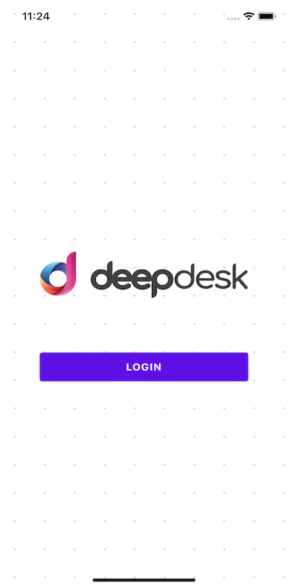
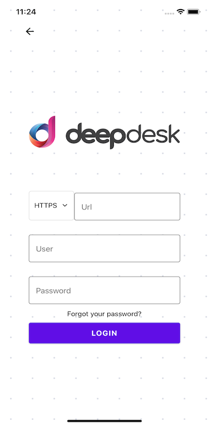
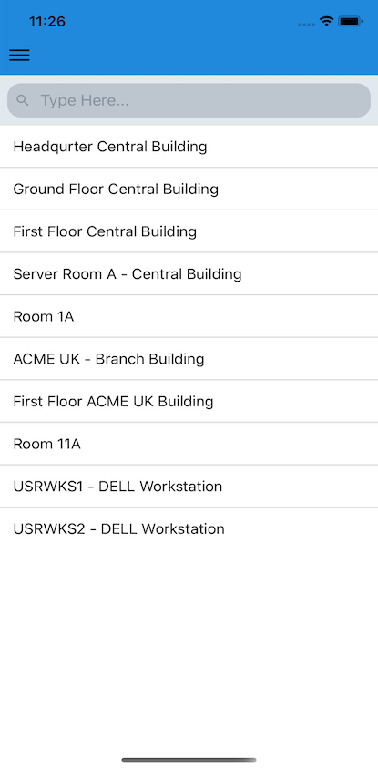
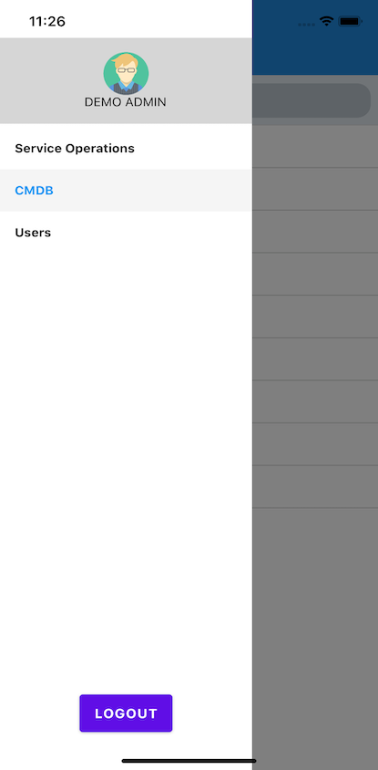

# [Deepser](https://deepser.com/) native app

## How to install?

* Download or clone this repo.

* Install dependencies.

```js
npm install
// or
yarn install
```

* Run project on iOS / Android.

```js
 npm run ios // npm run android
 // or
 yarn ios // yarn android
```

Project was created using [Expo](https://expo.io/). If you want standard native project please run following command:

```js
expo eject
```

## Preview
| Homepage | Login |
| --- | --- |
|||
| Dashboard | Menu |
|| |


## How to use?
You need to login with your Deepser credentials where url is your deepser host.

